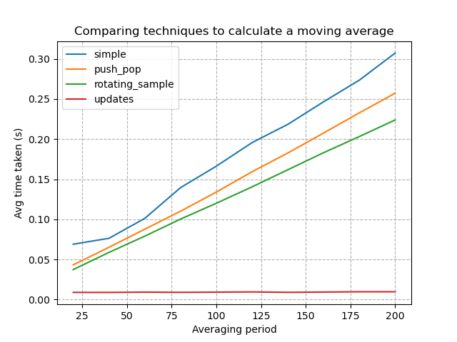
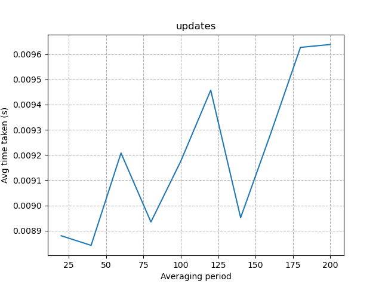

# Moving Average Calculations

Testing out a couple of ways to calculate a simple moving average. Nothing complex. No consideration for null values etc.

## Simple

Probably the most basic way I could think to do it. Take a slice of the previous N-values, calculate the sum and divide by the period.

## Push & Pop

Manually maintain a slice of the array as we loop through. Since we are only moving one element on & off the array at a time, it should be faster than taking a full period-length slice of the array at each step.

## Rotating Sample

Keep a fixed-length list in memory. As we go through the array, we need to pop an element off the beginning and add one at the end. In effect, this can be done by overwriting a value in the k-th position in the fixed-length array.

## Updates

When updating an average, if we know the value that is being removed and the one that is being added, we can update the mean using pure maths, without taking any array slices.

# Results

Unsurprisingly, the `simple` approach turned out to be the slowest. The push & pop and rotating sample approaches were faster, but it still demonstrates `O(N)` time complexity relative to the averaging period. Surprisingly, there was little performance benefit between these two techniques (I expected the rotating sample to be faster as it halves the number of array operations). The `updates` approach turned out to be the fastest, operating in `O(1)` constant time, independent of the averaging period.

## Results for updates specifically

As the updates results are significantly faster than the other techniques, I added a solo plot for the `updates` technique specifically which demonstrates that this technique runs in constant `O(1)` time.

